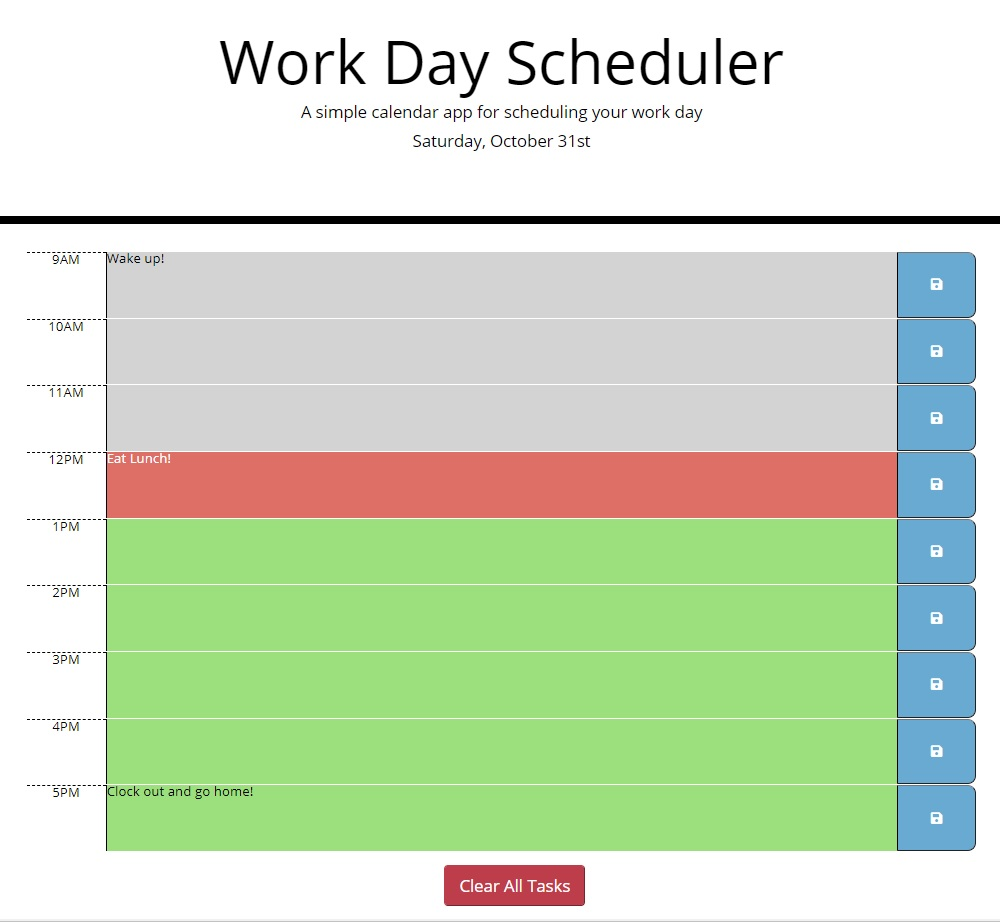

# day-planner

## Description
For this day planner project, I had to take existing index.html and style.css files and manipulate the DOM using jQuery elements to perform the following tasks for the day planner: 
    <ul>
        <li>Update the day planner to display the current date.</li>
        <li>Display the 9 time blocks (9am - 5pm) on the day planner.</li>
        <li>Create a save button for each time block to save the task that is typed in.</li>
        <li>Save any typed in tasks to local storage.</li>
        <li>Change the color of the text area based on the time, whether in the past (gray), present (red), or future (green).
        <li>Create a clear all tasks button to remove stored tasks from local storage.</li>
    </ul>
    
This was accomplished by: 
    <ul>
        <li>Using jQuery to manipulate the DOM of the index.html.</li>
        <li>Using moment.js to update the date to the current date as well as the time format for the time block times.</li>
        <li>Using jQuery on clicks for the save buttons and the clear all tasks button.</li>
        <li>Using functions to:</li>
        <li>Create time blocks: for the 9 different time blocks. Each time block included: the time slot, task description input, and a save button.</li>
        <li>Store tasks descriptions to local storage.</li>
        <li>Retrieve stored tasks descriptions from local storage.</li>
        <li>Update the task description colors based on the current time (whether past, present, or future).</li>
        <li>Clear all tasks from the local storage for the day.</li>
    </ul>

## Technologies Used
<ul>
    <li>HTML</li>
    <li>CSS</li>
    <li>jQuery</li>
    <li>Moment.js</li>
    <li>DOM Manipulation</li>
    <li>Functions</li>
    <li>Local Storage</li>
</ul>

## What I Learned

While working on this project, I learned how to use various jQuery elements to dynamically create time block divs tags on the index.html page. It's one thing to do it with vanilla JavaScript, and a whole other thing to do it with jQuery. I wanted to challenge myself by performing the tasks dynamically. I only added a clear task button to the index.html page. Outside of that, everything was done through the script file using jQuery. I can see why developers use jQuery as it seems to be more efficient. I went an extra step to add a clear all tasks button at the bottom of the day planner. That was more challenging than I thought. I had to learn about the ready on function for the script.js page. Once I implemented the ready on function around my clear all tasks button listener, it worked like a charm.

## Link to timed quiz website:
https://cdrobinsoniii.github.io/day-planner/